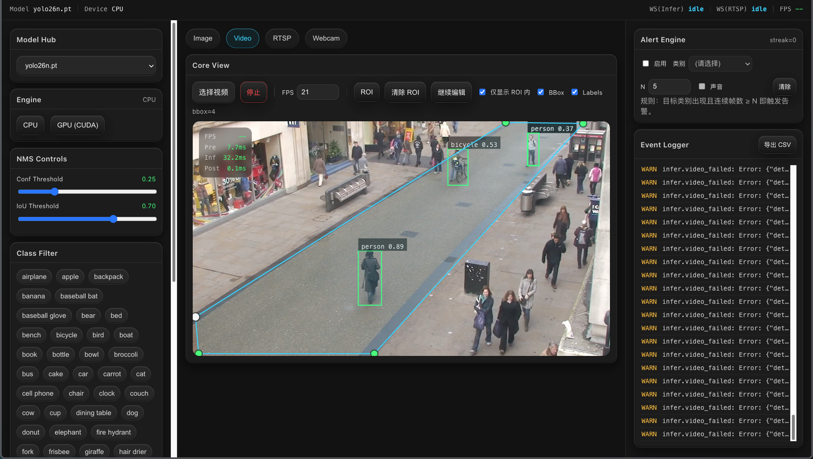

# Ultralytics 工业级前端推理控制台

面向工业质检 / 安防监控 / 算法调优场景的 **通用目标检测可视化控制台**：模型热切换、参数热更新、Image/Video/Webcam/RTSP/多路监控墙输入、OSD 叠加（含分割/姿态）、ByteTrack 跟踪 + 越线/区域计数事件、GPU/CPU/延迟监控、Webhook 告警出系统、配置一键导入导出、WebSocket 自动重连。

## 页面预览（Screenshot）



## 项目亮点（为什么值得用）

- **工业暗黑风 + Neo-Skeuomorphism**：适合长时间盯盘，关键状态一眼可读。
- **零阻塞实时重绘**：OSD 叠加基于 Canvas，不把高频图形更新塞进 React render；ResizeObserver 只挂一次。
- **零阻塞推理链路**：所有推理都走 `asyncio.to_thread`，REST + 多路 WS 互不阻塞；YOLO 调用串行化保证线程安全。
- **丢帧保实时**：Webcam/RTSP 推理链路"只处理最新帧" + WS `bufferedAmount` 背压，不卡 UI、不堆积。
- **可观测闭环**：HUD 遥测 + 系统资源面板（CPU/GPU/显存/温度/功耗）+ 推理延迟 P50/P95/P99 + 结构化事件流 + CSV 导出。
- **告警出系统**：内置钉钉 / 企微 / 飞书 / Slack / 通用 JSON 五种 Webhook 格式，按 (kind, ref) 维度冷却去重。
- **多路监控墙**：1×1 / 2×1 / 2×2 / 3×2 / 3×3 网格同屏多路 RTSP，单 WS 多路复用 streamId。
- **目标跟踪 + 事件**：内置 ByteTrack，画"计数线"/"计数区"自动统计 in/out / enter/leave，trackId 稳定颜色 + 轨迹尾迹。
- **断网自愈**：WebSocket 指数退避自动重连 + 心跳 ping/pong，重连后自动续播 RTSP，无需手动操作。
- **配置可迁移**：一键导出 JSON（参数/引擎/OSD/ROI/计数线区/告警/Webhook 全套），到另一台机拖拽即生效。
- **可替换推理内核**：默认 `pip install ultralytics`，支持切换到你"魔改版 ultralytics"。

## 功能一览

### 模型与环境控制
- **Model Hub**：从 `backend/models/` 下拉选择模型（`.pt/.onnx/.engine`），路径白名单校验
- **Engine**：CPU/CUDA 切换；同设备直接 no-op，不同设备只 warmup（不重 load 权重）
- **NMS**：Conf/IoU 滑块实时调整，前端 200ms 防抖回写
- **Class Filter**：多选标签过滤类别
- **Tracking**：勾选启用 ByteTrack（仅 Webcam / RTSP / Wall），bbox 自动带 `#trackId`

### 输入源
- **Image**：上传或**拖拽**即推理；阈值变化自动重跑（带 pending 队列）
- **Video**：本地视频 + 抽帧推理（可设目标 FPS，可丢帧），支持**拖拽**
- **Webcam**：浏览器摄像头实时推理（WS 推帧；toBlob 异步编码 + 背压控制）
- **RTSP**：填地址即连（后端拉流 → JPEG → WS）
- **Wall**：1×1 / 2×1 / 2×2 / 3×2 / 3×3 多路 RTSP 网格，每格独立 OSD + bbox 计数 HUD

### 可视化与效率
- **OSD**：BBox / Labels / Masks（实例分割半透明）/ Keypoints（COCO-17 骨架）/ Trails（轨迹尾迹）
- **稳定颜色**：按 trackId 哈希到 HSL，跨帧颜色一致
- **Telemetry HUD**：FPS / 耗时（Pre/Infer/Post）
- **ROI**：多边形绘制 +"仅显示 ROI 内目标"（前端过滤），支持触屏
- **Counting Line / Zone**：在画面上画线/画区，自动统计跨线/进出区
- **BadCase**：📷 一键打包下载 `zip(frame.jpg + config.json + pred.json)`

### 监控与数据沉淀
- **Event Logger**：滚动结构化日志，CSV 导出 `/api/logs/export.csv`
- **Alert Engine**：类别连续 N 帧触发告警（红色呼吸边框 + 可选蜂鸣）
- **Counters / Events**：实时显示线 in/out、区域 当前/累计 数量 + 最近 30 条事件流
- **System Stats**：CPU% / Mem / 多 GPU util/显存/温度/功耗 + 推理延迟 P50/P95/P99 + 60 帧 sparkline
- **Webhook**：钉钉 / 企微 / 飞书 / Slack / 通用 JSON 五种格式；告警 + 计数事件实时推送；按 (kind, ref) 冷却去重
- **Config Import / Export**：一键导出全套 JSON 配置；拖拽 JSON 到面板即应用

## 目录结构

```
backend/                    # FastAPI + Ultralytics 推理服务
├── app/
│   ├── main.py             # REST + 两路 WS（/ws/infer, /ws/stream 多路 streamId）
│   ├── infer_runtime.py    # YOLO 加载/推理/跟踪，masks + keypoints 提取
│   ├── system_stats.py     # CPU/GPU 监控 + 推理延迟 ring buffer
│   ├── webhook.py          # Webhook 配置持久化 + 多格式派发
│   ├── schemas.py          # Pydantic 模型（含 trackId/masks/keypoints/SystemStats）
│   ├── logging_store.py    # 内存 ring buffer + CSV 导出
│   └── state.py            # 全局可变状态（params / engine / logs）
├── models/                 # 权重文件（已 gitignore）
└── requirements.txt

frontend/                   # React 19 + Vite + TypeScript + zustand
└── src/
    ├── pages/ConsolePage   # 三栏布局（左控制 / 中视图 / 右监控），可拖拽分隔条
    ├── ui/
    │   ├── control/        # ControlPanel: Model/Engine/NMS/Class/Tracking
    │   ├── viewer/
    │   │   ├── tabs/       # Image/Video/Webcam/Rtsp/Wall
    │   │   └── widgets/    # CanvasOverlay / VideoCanvasOverlay / RoiOverlay /
    │   │                   # EventEditOverlay / TelemetryHUD
    │   ├── monitor/        # SystemStatsCard / WebhookCard / ConfigCard /
    │   │                   # MonitorPanel（Counters/Events/Alert/Logs）
    │   ├── status/         # 顶栏 SystemStatusBar
    │   └── primitives/     # Card / NeoButton
    ├── store/              # zustand 全局 store
    ├── api/                # REST + WS URL 工具
    └── utils/              # draw / events / roi / configIO / reconnectWs /
                            # useEventTracker / useSystemStats /
                            # useWebhookDispatcher / badcase
```

## 快速开始

### 1）准备模型文件
把权重文件放到 `backend/models/*.pt`（或 `.engine/.onnx`）

### 2）启动后端（FastAPI）

#### 方式 A：venv
```bash
cd backend
python3 -m venv .venv
source .venv/bin/activate
python -m pip install -r requirements.txt
uvicorn app.main:app --reload --port 8001
```

#### 方式 B：conda
```bash
conda create -n ultralytics-console python=3.10 -y
conda activate ultralytics-console
cd backend
python -m pip install -r requirements.txt
uvicorn app.main:app --reload --port 8001
```

> psutil / nvidia-ml-py / httpx 安装失败不影响主流程：监控面板会显示 "NVML 不可用"，Webhook 派发会回退失败状态，主推理链路依然可用。

### 3）启动前端（React）
```bash
cd frontend
npm install
npm run dev
```

前端开发服务器把 `/api` 与 `/ws` 代理到 `http://127.0.0.1:8001`。

## 常用配置

| 项 | 默认 | 来源 |
|---|---|---|
| 后端端口 | `8001` | 启动命令 |
| 模型目录 | `backend/models/`（相对 `infer_runtime.py`） | 环境变量 `ULTRA_MODELS_DIR` |
| Webhook 持久化 | `backend/.webhook.json`（gitignore） | 环境变量 `ULTRA_WEBHOOK_FILE` |
| 默认设备 | `cpu` | 环境变量 `ULTRA_DEVICE=cuda` |

## REST / WebSocket API

### REST
| Method | Path | 说明 |
|---|---|---|
| `GET` | `/api/health` | 健康检查 |
| `GET` | `/api/models` | 列出 `models/` 下可用模型 + 当前已加载模型回填 |
| `POST` | `/api/models/select` | 加载模型（`{modelId}`，做路径白名单 + 后缀校验） |
| `POST` | `/api/engine/select` | 切换 CPU/CUDA（`{device}`，同设备 no-op） |
| `GET` `/POST` | `/api/params` | 获取/更新 `{conf, iou, classFilter, track}` |
| `POST` | `/api/infer/image` | 单图推理（`multipart/form-data: file`） |
| `POST` | `/api/infer/frame` | Video 抽帧推理（同 image 入口） |
| `GET` | `/api/system/stats` | CPU/GPU/Mem + 推理延迟分位 |
| `GET` `/POST` | `/api/webhook` | 取/存 webhook 配置 |
| `POST` | `/api/webhook/test` | 联通性测试 |
| `POST` | `/api/notify` | 派发告警/事件到 webhook |
| `GET` | `/api/logs/export.csv` | 滚动日志 CSV 导出 |

### WebSocket
- `/ws/infer` — Webcam 推帧通道：客户端发 `{type:'frame', imageJpegBase64, ...}`，服务端回 `{type:'pred'|'log'}`；接受 `{type:'ping'}` → `{type:'pong'}`
- `/ws/stream` — RTSP 多路通道：
  - 客户端发 `{type:'rtsp.start', streamId, url, fps, conf, iou, classFilter, track}`
  - `{type:'rtsp.stop', streamId}` 单路停 / `{type:'rtsp.stopAll'}` 全停
  - 服务端回 `{type:'frame'|'pred'|'log', streamId, ...}`
  - 同样支持 `ping/pong`

## 使用"魔改版 ultralytics"的方式

### 方式 1：本地源码可编辑安装
```bash
conda activate ultralytics-console   # 或 source backend/.venv/bin/activate
python -m pip uninstall -y ultralytics
python -m pip install -e ~/work/ultralytics

cd backend
uvicorn app.main:app --reload --port 8001
```

修改源码后无需重新安装，重启 uvicorn 即可生效。

### 方式 2：把依赖指向本地路径
把 `backend/requirements.txt` 里的 `ultralytics` 改成：

```txt
-e /absolute/path/to/ultralytics
```

## Webhook 配置（钉钉示例）

1. 在监控面板 Webhook 卡片：
   - 勾选"启用"
   - URL 粘贴钉钉自定义机器人 webhook（推荐用"自定义关键词"安全模式）
   - 格式选"钉钉"，最低等级 `WARN`，冷却 30 秒
   - 事件类型勾上 `alert`、`line.cross`、`zone.enter`
   - 点"发送测试" → 群里收到 `ℹ️ [INFO] Webhook 测试`
2. 启用 Tracking + 画一条计数线 + 启动 Webcam/RTSP
3. 有目标穿线时群里实时收到：
   ```
   ⚠️ [WARN] 计数线 L1 in
   person#7
   ref: line_a8f1
   - trackId: 7
   - cls: person
   - direction: in
   ts: 2026-05-07 18:42:11
   ```

## 架构图

```mermaid
flowchart TB
  subgraph PresentationLayer["表现层（Presentation Layer）"]
    UI["Web Console UI (React/Vite)\n- Control (Model/Engine/Params/Class/Tracking)\n- Viewer (Image/Video/Webcam/RTSP/Wall) + Canvas OSD + HUD\n- Monitor (SystemStats/Webhook/Config/Counters/Events/Alert/Logs)"]
    BrowserMedia["Browser Media Inputs\n- File (Image/Video) + Drag&Drop\n- Webcam (getUserMedia)"]
  end

  subgraph BusinessLogicLayer["业务逻辑层（Business Logic Layer）"]
    ApiGateway["API Gateway (FastAPI)\n- /api/models /api/engine /api/params\n- /api/infer/image /api/infer/frame\n- /api/system/stats\n- /api/webhook* /api/notify\n- /api/logs/export.csv"]
    WsInfer["WS /ws/infer\n- Webcam frames (+ ping/pong)\n- → preds/logs"]
    WsStream["WS /ws/stream\n- 多路 streamId 路由\n- rtsp.start/stop/stopAll\n- → frames/preds/logs (含 streamId)"]
    Rules["Frontend Logic\n- ReconnectingWs (指数退避 + ping/pong)\n- ByteTrack 事件检测 (line/zone)\n- Alert rules + Webhook dispatcher\n- ROI / OSD / BadCase / Config IO"]
  end

  subgraph InferenceEngineLayer["推理引擎层（Inference Engine Layer）"]
    ModelRuntime["Ultralytics Runtime (YOLO)\n- Model hot-swap (.pt/.engine/.onnx)\n- Device switch (warmup-only)\n- NMS conf/iou\n- predict() / track(persist=True, ByteTrack)\n- masks.xy + keypoints 提取"]
    VideoDecode["Media Decode/Encode\n- RTSP decode (OpenCV VideoCapture)\n- JPEG encode/decode"]
    SysMon["System Monitor\n- psutil (CPU/Mem)\n- pynvml (GPU)\n- 推理延迟 ring buffer (P50/P95/P99)"]
  end

  subgraph DataLayer["数据层（Data Layer）"]
    ModelRepo["Model Repository\n- backend/models/*"]
    LogStore["Structured Log Store\n- In-memory ring buffer\n- CSV export"]
    WebhookStore["Webhook Config\n- backend/.webhook.json"]
    Artifacts["Artifacts (Local)\n- BadCase zip\n- Config JSON export"]
  end

  subgraph External["外部系统"]
    Channels["Webhook Channels\n- 钉钉 / 企微 / 飞书 / Slack / Generic"]
  end

  BrowserMedia --> UI

  UI -->|REST| ApiGateway
  UI -->|WS Webcam frames| WsInfer
  UI -->|WS RTSP 多路控制| WsStream
  UI -->|UI rules| Rules

  ApiGateway --> ModelRuntime
  WsInfer --> ModelRuntime
  WsStream --> VideoDecode
  VideoDecode --> ModelRuntime

  ModelRepo --> ModelRuntime
  ApiGateway --> LogStore
  ApiGateway --> SysMon
  ApiGateway --> WebhookStore
  WsInfer --> LogStore
  WsStream --> LogStore

  Rules --> Artifacts
  Rules -->|"POST /api/notify"| ApiGateway
  ApiGateway -->|"httpx POST"| Channels

  LogStore -->|export CSV| UI
  SysMon -->|stats poll| UI
  WsInfer -->|preds/telemetry/logs| UI
  WsStream -->|frames/preds/logs (streamId)| UI
```

## FAQ

### 1）为什么 RTSP 用 WS 推 JPEG 帧？
V1 优先"可用与易集成"：前端只需填地址即可出画面；后续如需更省带宽/更低延迟，可升级为 HLS/WebRTC + 单独 WS 下发 preds。

### 2）模型/权重文件会不会被提交到开源仓库？
不会：仓库已在 `.gitignore` 忽略 `backend/models/**/*.pt|onnx|engine` 等大文件类型，以及 `backend/.webhook.json`（含外部 URL 不入仓库）。

### 3）多路 Wall 同屏跟踪时 trackId 会不会跨路串号？
会。Ultralytics 的 `model.track(persist=True)` 在单 model 实例上是**全局状态**，多路同时跑时跨路实例可能共享 ID 池。需要严格分离请改成"每路独立 model 副本"（更费显存），v1 未做。

### 4）GPU 监控面板显示"NVML 不可用"？
说明 `nvidia-ml-py` 未安装或当前机器无 NVIDIA 驱动。CPU/Mem 仍可显示（依赖 `psutil`）；不影响推理。

### 5）Webhook 派发被钉钉拒绝？
钉钉自定义机器人若开了"加签安全"或"IP 白名单"会失败。建议先用"自定义关键词"模式（最简单），把关键词设成"告警"/"UltraConsole" 等。

### 6）WebSocket 自动重连会清空 ByteTrack 跟踪状态吗？
不会。后端 model 实例不变，trackId 在重连前后是连续的（同 model 同 persist 状态）。多数场景算优势，需要"重连即清空"再单独加。

### 7）配置导出的 JSON 里有 webhook URL 明文吗？
有。导出文件含敏感 URL，UI 上没遮挡。如需更严格可在导出前手工删除 webhook 字段，或后续加"导出时屏蔽 webhook"开关。

## 贡献指南
- 欢迎提 Issue/PR：
  - Bug：请带复现步骤、日志与输入源信息（Image/Video/Webcam/RTSP/Wall）
  - Feature：建议先开 Issue 讨论接口与交互
- 路线图（已落地以 ✅ 标）：
  - ✅ 多路监控墙、ByteTrack + 事件、分割/姿态、GPU/CPU HUD、延迟分位、Webhook、WS 重连、拖拽上传、配置导入导出
  - ⏳ 模型 A/B 对比、Tracking 热力图、Docker Compose、SQLite 持久化、Bearer Token 鉴权、i18n、截图导出、插件系统
