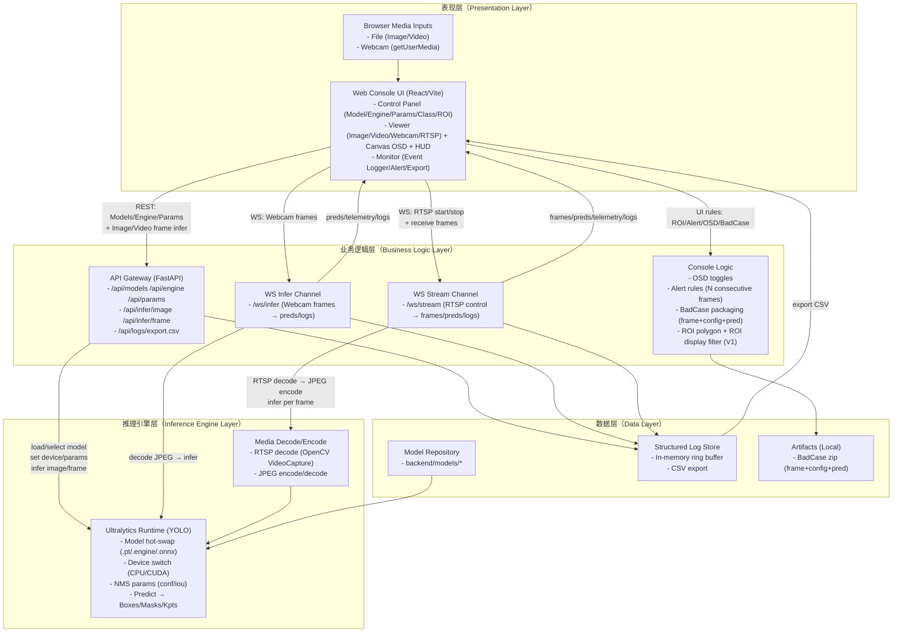

# Ultralytics 工业级前端推理控制台（V1.0）

面向工业质检 / 安防监控 / 算法调优场景的 **通用目标检测可视化控制台**：支持模型热切换、参数热更新、Webcam/Video/RTSP 输入、OSD 叠加渲染、遥测 HUD、结构化日志、阈值告警与 BadCase 归档。

## 页面预览（Screenshot）


## 项目亮点（为什么值得用）
- **工业暗黑风 + Neo-Skeuomorphism**：适合长时间盯盘，关键状态一眼可读。
- **零阻塞实时重绘**：OSD 叠加基于 Canvas，不把高频图形更新塞进 React render。
- **丢帧保实时**：Webcam/RTSP 推理链路“只处理最新帧”，不卡 UI。
- **可观测闭环**：HUD 遥测 + 结构化事件流 + CSV 导出，便于复盘与接入监控。
- **工程效率工具**：ROI 绘制、BadCase 一键打包下载（frame+config+pred）。
- **可替换推理内核**：默认 `pip install ultralytics`，支持切换到你“魔改版 ultralytics”。

## 功能一览
- **模型与环境控制**
  - Model Hub：从 `backend/models/` 下拉选择模型（`.pt/.onnx/.engine`）
  - Engine：CPU/CUDA 切换（含预热态）
  - NMS：Conf/IoU 滑块实时调整
  - Class Filter：多选标签过滤类别
- **输入源**
  - Image：上传即推理
  - Video：本地视频播放 + 抽帧推理（目标 FPS，可丢帧）
  - Webcam：浏览器摄像头实时推理（WS 推帧）
  - RTSP：填地址即连（后端拉流 → JPEG → WS 推帧）
- **可视化与效率**
  - OSD：BBox/Labels 开关
  - Telemetry HUD：FPS/耗时（Pre/Infer/Post）
  - ROI：多边形绘制 + “仅显示 ROI 内目标”（V1 前端过滤）
  - BadCase：📷 一键打包下载 `zip(frame.jpg + config.json + pred.json)`
- **监控与数据沉淀**
  - Event Logger：滚动日志
  - Alert Engine：类别连续 N 帧触发告警（红色呼吸边框 + 可选蜂鸣）
  - CSV 导出：`/api/logs/export.csv`

## 目录结构
- `backend/`：FastAPI + Ultralytics 推理服务（REST + WebSocket）
- `frontend/`：React + Vite + TypeScript 控制台

## 快速开始

### 1）准备模型文件
把权重文件放到：
- `backend/models/*.pt`（或 `.engine/.onnx`）

### 2）启动后端（FastAPI）

#### 方式 A：venv
```bash
cd backend
python3 -m venv .venv
source .venv/bin/activate
python -m pip install -r requirements.txt
uvicorn app.main:app --reload --port 8001
```

#### 方式 B：conda（推荐 CUDA/多环境并存时）
```bash
conda create -n ultralytics-console python=3.10 -y
conda activate ultralytics-console

cd backend
python -m pip install -r requirements.txt
uvicorn app.main:app --reload --port 8001
```

### 3）启动前端（React）
```bash
cd frontend
npm install
npm run dev
```

前端开发服务器会把 `/api` 与 `/ws` 代理到 `http://127.0.0.1:8001`。

## 常用配置
- **后端端口**：默认 `8001`（见启动命令）
- **模型目录**：默认 `backend/models/`（可通过环境变量 `ULTRA_MODELS_DIR` 指定）

## 使用“魔改版 ultralytics”的方式

### 方式 1：本地源码可编辑安装（推荐）
假设你魔改后的 ultralytics 源码在 `~/work/ultralytics`：

```bash
conda activate ultralytics-console   # 或 source backend/.venv/bin/activate
python -m pip uninstall -y ultralytics
python -m pip install -e ~/work/ultralytics

cd backend
uvicorn app.main:app --reload --port 8001
```

这样后端 `import ultralytics` 会直接使用你本地源码（修改后无需重新安装）。

### 方式 2：把依赖指向本地路径（用于固定环境）
把 `backend/requirements.txt` 里的 `ultralytics>=...` 改成：

```txt
-e /absolute/path/to/ultralytics
```

然后重新安装依赖即可。

## 架构图（论文/文档用）



## FAQ
### 1）为什么 RTSP 用 WS 推 JPEG 帧？
V1 优先“可用与易集成”：前端只需填地址即可出画面；后续如需更省带宽/更低延迟，可升级为 HLS/WebRTC + 单独 WS 下发 preds。

### 2）模型/权重文件会不会被提交到开源仓库？
不会：仓库已在 `.gitignore` 忽略 `backend/models/**/*.pt|onnx|engine` 等大文件类型。

## 贡献指南（Contributing）
- 欢迎提 Issue/PR：
  - Bug：请带复现步骤、日志与输入源信息（Image/Video/Webcam/RTSP）
  - Feature：建议先开 Issue 讨论接口与交互

## License
建议使用 `Apache-2.0` 或 `MIT`（按你的开源策略选择）。