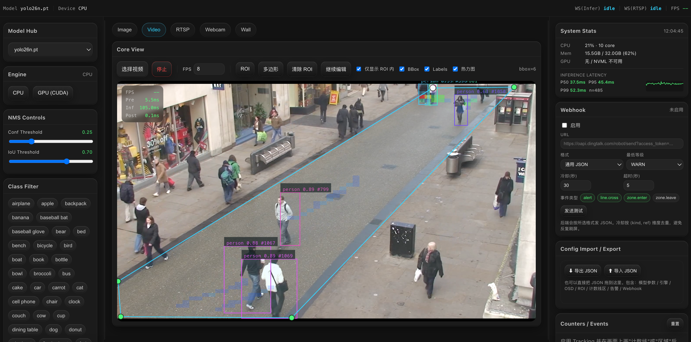
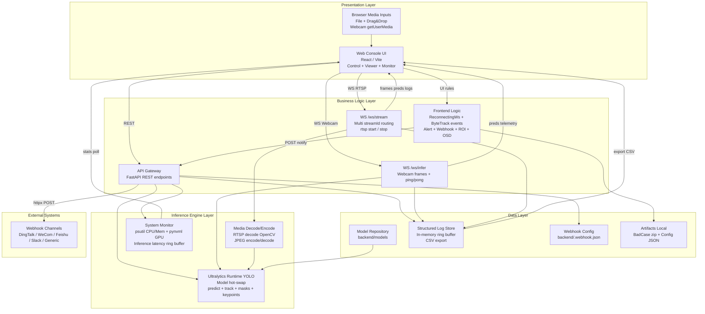

# Ultralytics Industrial Inference Console

**English** | [中文](README.md)

<p align="center">
  
  
  
  
  
  
  
</p>

<p align="center">
  <a href="https://github.com/WangQvQ/ultraconsole/blob/main/LICENSE"></a>
  <a href="https://github.com/WangQvQ/ultraconsole/stargazers"></a>
  <a href="https://github.com/WangQvQ/ultraconsole/issues"></a>
  <a href="https://github.com/WangQvQ/ultraconsole/commits"></a>
  
</p>

<p align="center">
  
  
  
  
  
  
  
  
  
  
</p>

An **industrial-grade object detection visualization console** for quality inspection, surveillance, and algorithm tuning: hot-swap models, live parameter tuning, Image/Video/Webcam/RTSP/Multi-camera Wall input, OSD overlays (segmentation/pose), ByteTrack tracking + line/zone counting events, spatial heatmap, GPU/CPU/latency monitoring, Webhook alerting, config import/export, WebSocket auto-reconnect.

## Screenshot



## Highlights

- **Industrial Dark Theme + Neo-Skeuomorphism**: Designed for long monitoring sessions; critical status at a glance.
- **Zero-blocking real-time redraw**: OSD overlays use Canvas, keeping high-frequency graphics out of React render; ResizeObserver attached only once.
- **Zero-blocking inference pipeline**: All inference runs via `asyncio.to_thread`; REST + multi-channel WS don't block each other; YOLO calls serialized for thread safety.
- **Drop-frame real-time**: Webcam/RTSP inference uses "process latest frame only" + WS `bufferedAmount` backpressure — no UI lag, no frame pile-up.
- **Observability closed-loop**: HUD telemetry + system resource panel (CPU/GPU/VRAM/temp/power) + inference latency P50/P95/P99 + structured event stream + CSV export.
- **External alerting**: Built-in DingTalk / WeCom / Feishu / Slack / Generic JSON webhook formats with (kind, ref) cooldown deduplication.
- **Multi-camera Wall**: 1×1 / 2×1 / 2×2 / 3×2 / 3×3 grid for simultaneous RTSP streams, single WS multiplexed by streamId.
- **Object Tracking + Events**: Built-in ByteTrack; draw "counting lines" / "counting zones" for in/out or enter/leave statistics; stable trackId colors + trail visualization.
- **Self-healing on disconnect**: WebSocket exponential backoff auto-reconnect + heartbeat ping/pong; RTSP streams auto-resume after reconnect.
- **Portable config**: One-click JSON export (params/engine/OSD/ROI/lines-zones/alerts/webhook); drag JSON to another machine to apply instantly.
- **Replaceable inference kernel**: Default `pip install ultralytics`; supports swapping to your custom ultralytics fork.

## Features

### Model & Environment Control
- **Model Hub**: Select models from `backend/models/` dropdown (`.pt/.onnx/.engine`), path whitelist validation
- **Engine**: CPU/CUDA toggle; same device = no-op, different device = warmup only (no weight reload)
- **NMS**: Conf/IoU sliders with live adjustment; frontend 200ms debounce writeback
- **Class Filter**: Multi-select label filtering
- **Tracking**: Enable ByteTrack (Webcam / RTSP / Wall / Video); bboxes auto-tagged with `#trackId`

### Input Sources
- **Image**: Upload or **drag-and-drop** for instant inference; threshold changes trigger re-run (with pending queue)
- **Video**: Local video + frame extraction inference (configurable target FPS, drop-frame support), **drag-and-drop** supported
- **Webcam**: Browser camera real-time inference (WS frame push; toBlob async encoding + backpressure)
- **RTSP**: Enter address to connect (backend pulls stream → JPEG → WS)
- **Wall**: 1×1 / 2×1 / 2×2 / 3×2 / 3×3 multi-RTSP grid, each cell with independent OSD + bbox count HUD

### Visualization & Efficiency
- **OSD**: BBox / Labels / Masks (instance segmentation semi-transparent) / Keypoints (COCO-17 skeleton) / Trails (trajectory tail)
- **Stable Colors**: trackId hashed to HSL for consistent cross-frame coloring
- **Telemetry HUD**: FPS / Latency (Pre/Infer/Post)
- **ROI**: Polygon + Rectangle draw modes; "show only ROI targets" (frontend filter); touch-screen supported
- **Counting Line / Zone**: Draw lines/zones on canvas for automatic in/out or enter/leave counting
- **BadCase**: One-click zip download `zip(frame.jpg + config.json + pred.json)`

### Monitoring & Data
- **Event Logger**: Scrolling structured logs, CSV export `/api/logs/export.csv`
- **Alert Engine**: Class consecutive N-frame trigger (red breathing border + optional beep)
- **Counters / Events**: Real-time line in/out, zone current/total counts + latest 30 event stream
- **System Stats**: CPU% / Mem / Multi-GPU util/VRAM/temp/power + Inference latency P50/P95/P99 + 60-frame sparkline
- **Webhook**: DingTalk / WeCom / Feishu / Slack / Generic JSON; alert + counting events real-time push; (kind, ref) cooldown dedup
- **Config Import / Export**: One-click JSON export; drag JSON to panel to apply

## Project Structure

```
backend/                    # FastAPI + Ultralytics inference service
├── app/
│   ├── main.py             # REST + two WS channels (/ws/infer, /ws/stream multi streamId)
│   ├── infer_runtime.py    # YOLO load/infer/track, masks + keypoints extraction
│   ├── system_stats.py     # CPU/GPU monitoring + inference latency ring buffer
│   ├── webhook.py          # Webhook config persistence + multi-format dispatch
│   ├── schemas.py          # Pydantic models (trackId/masks/keypoints/SystemStats)
│   ├── logging_store.py    # In-memory ring buffer + CSV export
│   └── state.py            # Global mutable state (params / engine / logs)
├── models/                 # Weight files (gitignored)
└── requirements.txt

frontend/                   # React 19 + Vite + TypeScript + zustand
└── src/
    ├── pages/ConsolePage   # 3-column layout (left control / center view / right monitor), draggable dividers
    ├── ui/
    │   ├── control/        # ControlPanel: Model/Engine/NMS/Class/Tracking
    │   ├── viewer/
    │   │   ├── tabs/       # Image/Video/Webcam/Rtsp/Wall
    │   │   └── widgets/    # CanvasOverlay / VideoCanvasOverlay / RoiOverlay /
    │   │                   # EventEditOverlay / TelemetryHUD
    │   ├── monitor/        # SystemStatsCard / WebhookCard / ConfigCard /
    │   │                   # MonitorPanel (Counters/Events/Alert/Logs)
    │   ├── status/         # Top bar SystemStatusBar
    │   └── primitives/     # Card / NeoButton
    ├── store/              # zustand global store
    ├── api/                # REST + WS URL utilities
    ├── i18n/               # Internationalization (zh/en)
    └── utils/              # draw / events / roi / configIO / reconnectWs /
                            # useEventTracker / useSystemStats /
                            # useWebhookDispatcher / badcase
```

## Quick Start

### 1) Prepare Model Files
Place weight files in `backend/models/*.pt` (or `.engine/.onnx`)

### 2) Start Backend (FastAPI)

#### Option A: venv
```bash
cd backend
python3 -m venv .venv
source .venv/bin/activate
python -m pip install -r requirements.txt
uvicorn app.main:app --reload --port 8001
```

#### Option B: conda
```bash
conda create -n ultralytics-console python=3.10 -y
conda activate ultralytics-console
cd backend
python -m pip install -r requirements.txt
uvicorn app.main:app --reload --port 8001
```

> psutil / nvidia-ml-py / httpx installation failures won't affect the main pipeline: the monitoring panel will show "NVML unavailable", webhook dispatch will fall back to failed status, but the core inference pipeline remains functional.

### 3) Start Frontend (React)
```bash
cd frontend
npm install
npm run dev
```

The frontend dev server proxies `/api` and `/ws` to `http://127.0.0.1:8001`.

## Configuration

| Item | Default | Source |
|---|---|---|
| Backend port | `8001` | Startup command |
| Models directory | `backend/models/` (relative to `infer_runtime.py`) | Env `ULTRA_MODELS_DIR` |
| Webhook persistence | `backend/.webhook.json` (gitignored) | Env `ULTRA_WEBHOOK_FILE` |
| Default device | `cpu` | Env `ULTRA_DEVICE=cuda` |

## REST / WebSocket API

### REST
| Method | Path | Description |
|---|---|---|
| `GET` | `/api/health` | Health check |
| `GET` | `/api/models` | List available models in `models/` + current loaded model backfill |
| `POST` | `/api/models/select` | Load model (`{modelId}`, path whitelist + extension validation) |
| `POST` | `/api/engine/select` | Switch CPU/CUDA (`{device}`, same device = no-op) |
| `GET` `/POST` | `/api/params` | Get/update `{conf, iou, classFilter, track}` |
| `POST` | `/api/infer/image` | Single image inference (`multipart/form-data: file`) |
| `POST` | `/api/infer/frame` | Video frame inference (same as image entry) |
| `GET` | `/api/system/stats` | CPU/GPU/Mem + inference latency percentiles |
| `GET` `/POST` | `/api/webhook` | Get/save webhook config |
| `POST` | `/api/webhook/test` | Connectivity test |
| `POST` | `/api/notify` | Dispatch alert/event to webhook |
| `GET` | `/api/logs/export.csv` | Structured log CSV export |

### WebSocket
- `/ws/infer` — Webcam frame push channel: client sends `{type:'frame', imageJpegBase64, ...}`, server returns `{type:'pred'|'log'}`; accepts `{type:'ping'}` → `{type:'pong'}`
- `/ws/stream` — RTSP multi-channel:
  - Client sends `{type:'rtsp.start', streamId, url, fps, conf, iou, classFilter, track}`
  - `{type:'rtsp.stop', streamId}` stops one stream / `{type:'rtsp.stopAll'}` stops all
  - Server returns `{type:'frame'|'pred'|'log', streamId, ...}`
  - Also supports `ping/pong`

## Using a Custom ultralytics Fork

### Option 1: Editable local source install
```bash
conda activate ultralytics-console   # or source backend/.venv/bin/activate
python -m pip uninstall -y ultralytics
python -m pip install -e ~/work/ultralytics

cd backend
uvicorn app.main:app --reload --port 8001
```

Source changes take effect on uvicorn restart — no reinstall needed.

### Option 2: Point dependency to local path
Change `ultralytics` in `backend/requirements.txt` to:

```txt
-e /absolute/path/to/ultralytics
```

## Webhook Configuration (DingTalk Example)

1. In the monitoring panel Webhook card:
   - Check "Enable"
   - Paste DingTalk custom robot webhook URL (recommend "custom keyword" security mode)
   - Format: "DingTalk", minimum level `WARN`, cooldown 30s
   - Event types: check `alert`, `line.cross`, `zone.enter`
   - Click "Send Test" → group receives `ℹ️ [INFO] Webhook test`
2. Enable Tracking + draw a counting line + start Webcam/RTSP
3. When a target crosses the line, the group receives in real-time:
   ```
   ⚠️ [WARN] Line L1 in
   person#7
   ref: line_a8f1
   - trackId: 7
   - cls: person
   - direction: in
   ts: 2026-05-07 18:42:11
   ```

## Architecture



## FAQ

### 1) Why does RTSP use WS to push JPEG frames?
V1 prioritizes "usability and easy integration": the frontend only needs to fill in an address to get a video stream. For lower bandwidth/latency needs, it can be upgraded to HLS/WebRTC + separate WS for preds.

### 2) Will model/weight files be committed to the open-source repo?
No: the repo's `.gitignore` already excludes `backend/models/**/*.pt|onnx|engine` and other large file types, as well as `backend/.webhook.json` (contains external URLs).

### 3) Will trackId collide across streams in multi-camera Wall?
Yes. Ultralytics' `model.track(persist=True)` has **global state** on a single model instance — cross-stream instances may share an ID pool. For strict separation, use "per-stream model副本" (more VRAM); V1 doesn't do this.

### 4) GPU monitoring panel shows "NVML unavailable"?
This means `nvidia-ml-py` is not installed or the machine has no NVIDIA driver. CPU/Mem still works (via `psutil`); inference is not affected.

### 5) Webhook dispatch rejected by DingTalk?
DingTalk custom robots with "signature security" or "IP whitelist" will fail. Start with "custom keyword" mode (simplest), setting keywords like "alert" / "UltraConsole".

### 6) Does WebSocket auto-reconnect clear ByteTrack state?
No. The backend model instance is unchanged; trackId is continuous across reconnects (same model, same persist state). This is usually an advantage — add "clear on reconnect" separately if needed.

### 7) Does the exported config JSON contain webhook URLs in plaintext?
Yes. The exported file contains sensitive URLs without masking in the UI. For stricter security, manually remove the webhook field before export, or add an "export without webhook" toggle later.

## Contributing
- Issues/PRs welcome:
  - Bug: include reproduction steps, logs, and input source info (Image/Video/Webcam/RTSP/Wall)
  - Feature: suggest opening an Issue first to discuss interface and interaction
- Roadmap (✅ = shipped):
  - ✅ Multi-camera Wall, ByteTrack + Events, Segmentation/Pose, GPU/CPU HUD, Latency percentiles, Webhook, WS reconnect, Drag-and-drop, Config import/export
  - ⏳ Model A/B comparison, Tracking heatmap, Docker Compose, SQLite persistence, Bearer Token auth, i18n, Screenshot export, Plugin system
